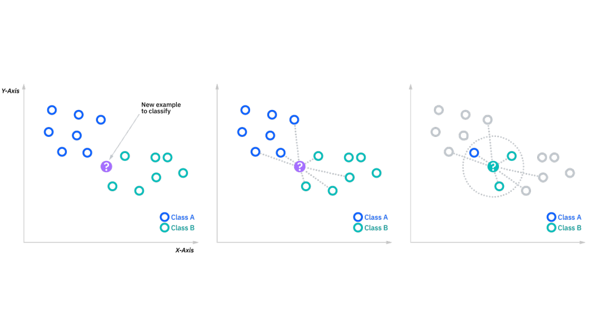
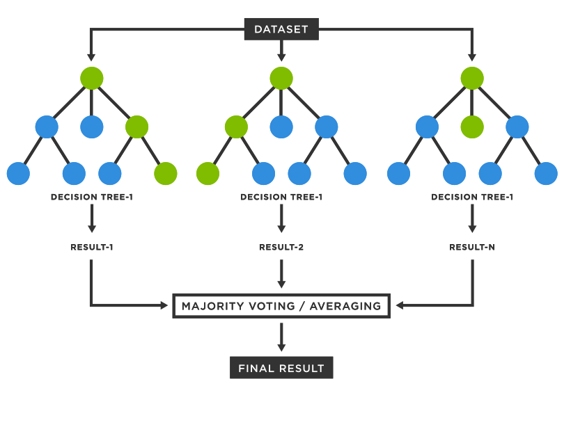

```{r setup, include=FALSE}
knitr::opts_chunk$set(echo = TRUE, message = FALSE,
                      warning = FALSE)
```


## Abstract
The purpose of this project is to build a machine learning model to predict the probability of hotel reservation cancellation. The data set used in this project is found from Kaggle. This project will be divided into 5 separate parts: Part I will be an overview of the data set and the motivation behind this project; Part II will be dedicated to data analysis and preparation, including data split, handeling missing data, and more; Part III will focus on building models and fitting the training data; Part IV will be about model evaluation, which will be primarily based on performance metrics such as AOC; lastly, Part V will be the conclusion, which includes limitations and potential improvements. 

## Part I - Introduction
### Inspiration and Motivation
Whether you are traveling for business or tourist purposes, booking a suitable hotel is essential. However, sometimes the experience may be unsatisfactory: flight cancellation due to bad weather, unforeseen circumstances like sudden illness, and the list goes on. In those case, reservation cancellation has to be made. In general, cancellations are a common occurrence in the hotel industry, and hotels typically have policies in place to handle cancellations and minimize the impact on their operations.

On the other hand, hotel companies themselves make future plans based on predictions. For example, by analyzing historical data and current market trends, hotels can predict the demand for their rooms in the future. This helps them to adjust their rates and inventory accordingly to maximize revenue. In addition, With reservation predictions, hotels can adjust their rates based on anticipated demand. This allows them to offer competitive rates during slower periods and raise rates during high-demand periods to increase revenue. Last but not least, with accurate reservation predictions, hotels can allocate staff and other resources to meet expected demand. This helps them to ensure that they have the right number of staff and resources to provide a high level of service to their guests.

This project will focus primarily on predicting hotel reservation statues using machine learning models. 

### Overview on the data set
The data set used in this project is downloaded from kaggle. 

Below is the link direct to the data set.

<https://www.kaggle.com/datasets/ahsan81/hotel-reservations-classification-dataset?resource=download>

```{r}
# Load the csv data file using read.csv() function.
hotel <- read.csv('data/hotel_reservation/Hotel_Reservations.csv')
```

```{r}
# Peak into the data set by calling head() function.
head(hotel)

# checking the dimension of the data file.
dim(hotel)
```

Based on the `dim()` function, there are 19 columns and 36275 rows in total, which indicates that the dataset contains 19 variables and 36275 observations. Furthermore, the file contains the different attributes of customers' reservation details. The detailed data dictionary is given below.

• `Booking_ID`: unique identifier of each booking

• `no_of_adults`: Number of adults

• `no_of_children`: Number of Children

• `no_of_weekend_nights`: Number of weekend nights (Saturday or Sunday) the guest stayed or booked to stay at the hotel

• `no_of_week_nights`: Number of week nights (Monday to Friday) the guest stayed or booked to stay at the hotel

• `type_of_meal_plan`: Type of meal plan booked by the customer:

• `required_car_parking_space`: Does the customer require a car parking space? (0 - No, 1- Yes)

• `room_type_reserved`: Type of room reserved by the customer. The values are ciphered (encoded) by INN Hotels.

• `lead_time`: Number of days between the date of booking and the arrival date

• `arrival_year`: Year of arrival date

• `arrival_month`: Month of arrival date

• `arrival_date`: Date of the month

• `market_segment_type`: Market segment designation.

• `repeated_guest`: Is the customer a repeated guest? (0 - No, 1- Yes)

• `no_of_previous_cancellations`: Number of previous bookings that were canceled by the customer prior to the current booking

• `no_of_previous_bookings_not_canceled`: Number of previous bookings not canceled by the customer prior to the current booking

• `avg_price_per_room`: Average price per day of the reservation; prices of the rooms are dynamic. (in euros)

• `no_of_special_requests`: Total number of special requests made by the customer (e.g. high floor, view from the room, etc)

• `booking_status`: Flag indicating if the booking was canceled or not.

Those information are provided by the author of the data set. Based on this information, we are able to identify the class and usefulness of each variable. Intuitively, `Booking_ID` is not a useful variable for our model; in addition, `arrival_year` may not be very significant compared to `arrival_month` and `arrival_date` considering holiday influences. 

Besides, we also have to make sure all categorical variables are factorized. This will include `type_of_meal_plan`, `required_car_parking_space`, `room_type_reserved`, `market_segment_type`, `repeated_guest`, and `booking_status`.

## Part II - Data Analysis
### Exploring our data

```{r, message=FALSE}
# Package load
library(tidyverse)
library(tidymodels)
library(discrim)
library(naniar) # check missing value
library(ggplot2)
library(janitor) # clean_names()
library(corrplot) # correlation matrix
library(parallel)
library(doParallel) # registerDoParallel()
library(ranger) # random forest
library(themis)
library(xgboost) # boosted tree
library(vip) # variable importance plot
tidymodels_prefer()
registerDoParallel(cores = detectCores())
```

Firstly, let us check whether there is any missing data.

```{r}
# Checking for missing data by calling vis_miss() function from naniar package.
vis_miss(hotel)
```

Fortunately, by the missing data graph, we can see all observations are presented completely with no missing value. 

### Data process

In general, we are good with 18 predictors for our model construction. However, as we mentioned in the last section, `Booking_ID` do not appear to be a significant predictor for predicting whether a reservation may be cancelled. It is better to be removed to obtain simpler data set.

```{r}
# Removing Booking_ID from the data set by calling subset() function.
hotel <- hotel %>%
  subset(select=-c(Booking_ID))

# Check the completeness of last command.
ls(hotel)
```

Now, we have Booking_ID removed from the dataset, we are left with 17 predictors and over 30,000 observations, which is sufficient for model training.

In addition, we may call `clean_names()` function from `janitor` package to clean up column names in the data frame. It applies a set of transformations to the column names to make them more consistent and easier to work with. However, for our dataset, the column names are already cleaned where there's no presence of uppercase character, dot, or any special character other than lowercase characters and underline.

Moving on, we have to ensure all categorical variables (`type_of_meal_plan`, `required_car_parking_space`, `room_type_reserved`, `market_segment_type`, `repeated_guest`, `booking_status`) are factorized.

```{r include=FALSE}
# using mutate() function to factorize all categorical variables.
hotel <- hotel %>%
  mutate(type_of_meal_plan = factor(type_of_meal_plan),
         required_car_parking_space = factor(required_car_parking_space),
         room_type_reserved = factor(room_type_reserved),
         market_segment_type = factor(market_segment_type),
         repeated_guest = factor(repeated_guest),
         booking_status = factor(booking_status))

# check the last completeness of last command.
c(class(hotel$type_of_meal_plan), class(hotel$required_car_parking_space), 
  class(hotel$room_type_reserved), class(hotel$market_segment_type), 
  class(hotel$repeated_guest), class(hotel$booking_status))
```

Now since our data set is ready, we can perform initial data split. For this particular project, stratified sampling is implemented since the outcome (response variable) is binary and imbalanced, that is “Not_canceled” or “Canceled”. Stratified sampling ensures that the 'answer key' in the training data are not seriously inclined toward one response. Overall, the purpose of stratified sampling is to improve the representatives of the sample by ensuring that the sample reflects the diversity of the population in terms of the characteristics used to create the strata. This is particularly useful when the characteristics of interest are unevenly distributed in the population and when the sample size is limited.

In this case, the sampling will be based on booking_status.

### Data Split

```{r}
# setting seed for reproducing the same result.
set.seed(123)

# calling split functions to divide the data into training and testing sets. Setting strata = booking_status.
hotel_split <- initial_split(hotel, strata = booking_status, prop = 0.8)
hotel_train <- training(hotel_split)
hotel_test <- testing(hotel_split)
```

check the distribution of outcome variable.

```{r}
# frequency of booking_status
hotel_train %>%
  ggplot(aes(x=booking_status)) + geom_bar()
```

From the geometric bar plot, most responses of observations in the training data set are not_canceled, which is double the observation that is canceled. We may address this by using up-sampling method when creating our recipe. However, since the number of canceled reservation are approximately halve of the reservations that are not cancelled, up-sampling may be unnecessary since it can lead to overfitting. 

Now, let's check correlation between numerical variables to get a brief sense of their relationship.

### Exploring Our Training Data

```{r}
# correlation matrix of numeric variables
hotel_train %>%
  select(where(is.numeric)) %>%
  cor() %>%
  corrplot(method='color', type='lower', diag=FALSE)
```

From the correlation plot, we can see there's a positive relationship between `no_of_previous_booking_not_cancelled` and `no_of_previous_booking_cancelled`.

Check the relationship with categorical variables with percent stacked bar chart with .

```{r}
# check the distribution of type_of_meal_plan based on booking_status
hotel_train %>%
  ggplot(aes(fill=(type_of_meal_plan), x=booking_status)) +
    geom_bar(position='fill', stat='count')
```

```{r}
# check the distribution of room_type_reserved based on booking_status
hotel_train %>%
  ggplot(aes(fill=(room_type_reserved), x=booking_status)) +
    geom_bar(position='fill', stat='count')
```

```{r}
# check the distribution of repeated_guest based on booking_status
hotel_train %>%
  ggplot(aes(fill=(repeated_guest), x=booking_status)) +
    geom_bar(position='fill', stat='count')
```

```{r}
# check the distribution of market_segment_type based on booking_status
hotel_train %>%
  ggplot(aes(fill=(market_segment_type), x=booking_status)) +
    geom_bar(position='fill', stat='count')
```

From the above plots, meal plan and type of room do not have significant effect on people making reservation decisions. However, there is a trend showing that people who canceled their reservation are more likely to book hotel online compared to those who did not cancel their booking. Meanwhile, we can see a significant portion of not-cancelled reservation are occupied by repeated_guest Hence, the way people book their hotel and whether they are repeated guest of a hotel might be a good predictor.

### Cross-validation

We will create 10 folds to conduct k-fold (10-fold in our case) stratified cross validation. This means that R is taking the training data and assigning each observation in the training data to 1 of 10 folds. For each fold, a testing set is created consisting of that fold and the remaining k-1 folds will be the training set for that fold. At the end, we end up with k total folds.

K-fold cross validation is done by splitting the data into k folds as described above with each fold being a testing set with the other k-1 folds being the training set for that fold. Then, whichever model we are fitting is fit to each training set and tested on the corresponding testing set (each time, a different fold should be used as a validation set). Then, the average accuracy is taken from the testing set of each of the folds to measure performance (other metrics can be taken as well such as standard error).

We use k-fold cross validation rather than simply fitting and testing models on the entire training set because cross validation provides a better estimate of the testing accuracy. It is better to take the mean accuracy from several samples instead of just one accuracy from one sample because, as n increases, we reduce variation.

We will stratify on the outcome, booking_status, to make sure the data in each fold is not imbalanced.

```{r}
# create folds for cross-validation training data
hotel_folds <- vfold_cv(hotel_train, v = 5, strata = booking_status)
```

## Part III - Model Construction
### Building Recipe
As our data set are ready to go, we can start build the recipe for our models.

```{r}
# create recipe
hotel_recipe <- recipe(booking_status~., data=hotel_train) %>%
  step_dummy(all_nominal_predictors()) %>%
  step_center(all_predictors()) %>%
  step_scale(all_predictors())
```

In the recipe procedure, we set `booking_status` as outcome variable and the rest as predictors. We also called `step_dummy()` function to dummy code all categorical variables. `step_scale()` function will creates a specification of a recipe step that will normalize numeric data to have a standard deviation of one; while `step_center` will creates a specification of a recipe step that will normalize numeric data to have a mean of zero.

### Building Models
Most model building process follows the same process. For this project, we will be fitting Logistic Regression Model, linear discriminant analysis (LDA) model, K-nearest neighbor (KNN) model, Elastic Net Logistic Regression Model, Random Forest Model, and Boosted Tree Model following the following steps. 

Then, we will pick the top 3 performance model based on ROC AUC metric and evaluating them on the testing data.s

Step 1: Setting up model structure by specifying its type, engine, mode, and tuning parameters. For this project, the mode will be set to "Classification" by nature.
```{r}
# logistic regression model
hotel_lm_mod <- logistic_reg() %>%
  set_mode("classification") %>% 
  set_engine("glm")

# LDA model
hotel_lda_mod <- discrim_linear() %>%
  set_mode('classification') %>%
  set_engine('MASS')

# K-Nearest Neighbor model.
hotel_knn_mod <- nearest_neighbor(neighbors = tune()) %>%
  set_mode("classification") %>%
  set_engine("kknn")

# elastic net logistic regression model.
hotel_elasticlm_mod <- logistic_reg(penalty = tune(), mixture = tune()) %>%
  set_engine("glmnet") %>%
  set_mode('classification')

# random forest 
hotel_rdforest_mod <- rand_forest(mtry = tune(), trees = tune(), min_n = tune()) %>%
  set_engine('ranger', importance = "impurity") %>%
  set_mode('classification')

# boosted tree
hotel_bstree_mod <- boost_tree(mtry = tune(), trees = tune(), learn_rate = tune()) %>%
  set_engine("xgboost") %>% 
  set_mode("classification")
```

Step 2: Set up workflow respect to each model.

```{r}
# Logistic regression model workflow
hotel_lm_wkflow <- workflow() %>% 
  add_model(hotel_lm_mod) %>% 
  add_recipe(hotel_recipe)

# LDA workflow
hotel_lda_wkflow <- workflow() %>% 
  add_model(hotel_lda_mod) %>% 
  add_recipe(hotel_recipe)

# KNN workflow
hotel_knn_wkflow <- workflow() %>%
  add_model(hotel_knn_mod) %>%
  add_recipe(hotel_recipe)

# elastic net workflow
hotel_elasticlm_wkflow <- workflow() %>%
  add_model(hotel_elasticlm_mod) %>%
  add_recipe(hotel_recipe)

# random forest workflow
hotel_rdforest_wkflow <- workflow() %>%
  add_model(hotel_rdforest_mod) %>%
  add_recipe(hotel_recipe)

# boosted trees workflow
hotel_bstree_wkflow <- workflow() %>%
  add_model(hotel_bstree_mod) %>%
  add_recipe(hotel_recipe)
```

Step 3: Other than the logistic regression and LDA models, the rest models require us to create a tuning grid to specify the ranges of the parameters.

```{r}
# Using grid_regular to set up grids of values for all of the parameters we’re tuning.
hotel_neighbors_grid <- grid_regular(neighbors(range = c(10, 50)), levels = 20)

hotel_elastic_grid <- grid_regular(penalty(range = c(0, 1),
                                     trans = identity_trans()), mixture(range = c(0, 1)), levels = 10)

hotel_rdforest_grid <- grid_regular(mtry(range = c(5,17)), trees(range = c(200, 600)), min_n(range = c(5,10)), levels = 5)

hotel_bstree_grid <- grid_regular(mtry(range = c(5,17)), trees(range = c(200, 600)), learn_rate(range = c(0.01,0.1), trans = identity_trans()), levels = 5)
```

Step 4: Tune the model and specify the workflow, k-fold cross validation folds, and the tuning grid for our chosen parameters to tune.

```{r eval=FALSE}
# Fitting Logistic Regression model
hotel_lmtune_res <- tune_grid(
  object = hotel_lm_wkflow,
  resamples = hotel_folds,
)

# Fitting LDA model
hotel_lda_res <- tune_grid(
  object = hotel_lda_wkflow,
  resamples = hotel_folds,
)
```

```{r, eval = FALSE}
registerDoParallel(cores = detectCores())

# Fitting KNN model
hotel_knntune_res <- tune_grid(
  object = hotel_knn_wkflow, 
  resamples = hotel_folds, 
  grid = hotel_neighbors_grid,
)

# fitting Elastic Net Regression model
hotel_elatune_res <- tune_grid(
  object = hotel_elasticlm_wkflow,
  resamples = hotel_folds,
  grid = hotel_elastic_grid
)
```

```{r, eval=FALSE}
registerDoParallel(cores = detectCores())

# fitting random forest model
hotel_rdforest_res <- tune_grid(
  object = hotel_rdforest_wkflow,
  resamples = hotel_folds,
  grid = hotel_rdforest_grid
)

# fitting boosted trees model
hotel_bstree_res <- tune_grid(
  object = hotel_bstree_wkflow,
  resamples = hotel_folds,
  grid = hotel_bstree_grid
)
```

Step 5: save the finished tuned model to respective .rda files to save time when knitting the rmd file.

```{r eval=FALSE}
# save completed models to respective .rda files, which can save us tons of time when knit the reports
save(hotel_lmtune_res, file='model_rda/hotel_lmtune_res.rda')

save(hotel_lda_res, file='model_rda/hotel_lda_res.rda')

save(hotel_knntune_res, file='model_rda/hotel_knntune_res.rda')

save(hotel_elatune_res, file='model_rda/hotel_elatune_res.rda')

save(hotel_rdforest_res, file='model_rda/hotel_rdforest_res.rda')

save(hotel_bstree_res, file='model_rda/hotel_bstree_res.rda')
```

Step 6: read the .rda files to reload the models.

```{r}
# read saved .rda files to input the models
load(file='model_rda/hotel_lmtune_res.rda')

load(file='model_rda/hotel_lda_res.rda')

load(file='model_rda/hotel_knntune_res.rda')

load(file='model_rda/hotel_elatune_res.rda')

load(file='model_rda/hotel_rdforest_res.rda')

load(file='model_rda/hotel_bstree_res.rda')
```

## Part IV - Model Performance
### Model Results
Now as we finished tuning the model corresponds to chosen range of parameters, it is time to compare our model results. We are using ROC (Receiver Operating Characteristic) Curves as our performance metric to evaluate the model performance. In general, the area under the ROC curve (AUC) can be used as a summary statistic to quantify the overall performance of a classifier. An AUC of 1 indicates perfect classification, while an AUC of 0.5 indicates that the classifier is no better than random guessing. Besides, we will also take a look at model accuracy when predicting outcome in the cross-validation data. Accuracy measures the percentage of correct predictions made by the model, i.e., the ratio of correct predictions to the total number of predictions. While accuracy is a straightforward and widely used metric, it may not always be the most appropriate metric, especially in imbalanced data sets where the distribution of classes is not uniform.

```{r}
# collect the highest mean roc_auc and accuracy values of each model
lm_auc <- collect_metrics(hotel_lmtune_res)$mean[2]
lm_accracy <- collect_metrics(hotel_lmtune_res)$mean[1]

lda_auc <- collect_metrics(hotel_lda_res)$mean[2]
lda_accuracy <- collect_metrics(hotel_lda_res)$mean[1]

knn_auc <- show_best(hotel_knntune_res, metric='roc_auc', n=1)$mean
knn_accuracy <- show_best(hotel_knntune_res, metric='accuracy', n=1)$mean

ela_auc <- show_best(hotel_elatune_res, metric='roc_auc', n=1)$mean
ela_accuracy <- show_best(hotel_elatune_res, metric='accuracy', n=1)$mean

rdforest_auc <- show_best(hotel_rdforest_res, metric='roc_auc', n=1)$mean
rdforest_accuracy <- show_best(hotel_rdforest_res, metric='accuracy', n=1)$mean

bstree_auc <- show_best(hotel_bstree_res, metric='roc_auc', n=1)$mean
bstree_accuracy <- show_best(hotel_bstree_res, metric='accuracy', n=1)$mean
```

```{r}
# Model metrics summarize
model_comparison <- data.frame(
  models = c("Logistic Regression", "LDA", "KNN", "Elastic Net", "Random Forest", "Boosted Trees"), 
  roc_auc = c(lm_auc, lda_auc, knn_auc, ela_auc, rdforest_auc, bstree_auc), 
  accuracy = c(lm_accracy, lda_accuracy, knn_accuracy, ela_accuracy, rdforest_accuracy, bstree_accuracy))

model_comparison %>%
  arrange(roc_auc)
```

```{r}
# graphical comparison of the ROC AUC values
model_comparison %>%
  ggplot(aes(x=models, y=roc_auc)) +
  geom_bar(stat = "identity", aes(fill = accuracy))
```

Unsurprisingly, the top 3 performing models are Boosted Trees, Random Forest, and KNN model across cross-validation data. Models with higher ROC AUC values also tend to have better accuracy when predicting outcome. Besides, the results appears to have a pattern where more complex model tend to perform better than simple models such as logistic regression and LDA model. 

To visualize how our models perform on different parameter settings, we can plot these top 3 models using autoplot()

#### K-nearest Neighbors Model

In the KNN model, the algorithm finds the k closest data points in the training set to a given test data point, based on some distance metric (such as Euclidean distance or Manhattan distance). The class or regression value of the test data point is then determined by taking the majority class or the average value, respectively, of the k nearest neighbors.



KNN is a simple yet effective model that does not require any training process or assumptions about the underlying distribution of the data. However, it can become computationally expensive for large datasets and may not perform well when the number of features is high or when there is a class imbalance in the dataset.

```{r}
# tuning result of KNN models
autoplot(hotel_knntune_res)
```

For the KNN model, we set a range of k value from 10 to 50 with 20 levels. The value of K is difficult to determine since there is no fixed rule for selecting the optimal value of k, as it depends on the nature of the data and the problem at hand. The best approach for us is to specify a range of K values and let the model to be trained and evaluated on a validation set for each value of k. The k value that gives the best performance on the validation set is selected as the optimal value. 

Compared to simpler model such as logistic regression and LDA models, tuning process takes much longer time for the KNN model to train through the cross-validation sets. As shown in the graph of our tuning result on the KNN model, the best performing K-value tend to be centered around 20 to 25. The ROC AUC value starts at an increasing rate from k=10; it reaches its peak at k=22, and then it starts to drop as the k value increases. Interestingly, model with the highest ROC AUC value does not also have the highest accuracy. A high ROC AUC value means that the model is able to differentiate between positive and negative samples very well, but it does not guarantee that the model is able to accurately classify all samples. For example, a model may have a high ROC AUC value because it correctly classifies all the positive samples, but misclassifies many of the negative samples, leading to a lower accuracy.

#### Random Forest Model

Random forest is a popular ensemble learning algorithm used in machine learning for classification and regression tasks. The algorithm combines multiple decision trees, each trained on a random subset of the input features and a subset of the training data, to make predictions.



One of the key benefits of the random forest algorithm is that it can handle high-dimensional data and can capture complex interactions between features. Additionally, random forests are less prone to overfitting than individual decision trees, as the averaging of multiple trees helps to reduce the variance in the model.

```{r}
# tuning result of random forest models
autoplot(hotel_rdforest_res)
```

Similar to the tuning process of KNN model, the Random forest model takes even more computational power to train across the cross-validation data set since since it is difficult to determine the exact number of decision trees to be grown, minimum number of samples, number of variables randomly selected as candidates for splitting at each node in a decision tree. By tuning these hyperparameters, a random forest model can be optimized with a trade-off between model performance and computational power. The model took forever to run when I set high value of parameters such as number of trees. In the graph, as expected, less minimum node size and more number of trees appears to perform better; however, increase the number of randomly selected predictors does not always improve model accuracy, where we can see a intermediate value of `mtry` tend to output better performance.

#### Boosted Trees Model
Boosted Trees is an ensemble method that combines several decision trees into a single model. During training, each instance in the data is given a weight that reflects how important it is to the learning process. Instances that are poorly classified by the current model are given higher weights, making them more likely to be selected for the next round of training. similar to random forest, Boosted Trees is good because it can handle different types of data and can capture complex relationships between variables. It's also less likely to overfit than other similar techniques.


```{r}
# tuning result of boosted tree models
autoplot(hotel_bstree_res)
```

Different from Random Forest Model, Boosted Trees Model has new parameter called Learning Rate. Specifically, the learning rate controls the amount of weight that is given to each new decision tree that is added to the model. A smaller learning rate means that each new tree has a smaller impact on the final model, while a larger learning rate means that each new tree has a larger impact. For the Boosted Tree Model, we tuned the learning rate, number of randomly selected predictors, and number of trees. In the graph, we can see the model tend to perform better with the increase of learning rate, number of trees, and randomly selected predictors in both metrics. 

### Final Fitting

Now it is time to fit our top 3 performing model to our entire training data. This will train our chosen top 3 models with fixed parameters one more time on the entire training data set.

```{r}
# fitting best performing KNN model
hotel_best_neighbors <- select_best(hotel_knntune_res, metric = 'roc_auc')
hotel_knn_final_wf <- finalize_workflow(hotel_knn_wkflow, hotel_best_neighbors)
hotel_knn_final_fit <- fit(hotel_knn_final_wf, hotel_train)

# fitting best performing random forest model
hotel_best_rdforest <- select_best(hotel_rdforest_res, metric = 'roc_auc')
hotel_rdforest_final_wf <- finalize_workflow(hotel_rdforest_wkflow, hotel_best_rdforest)
hotel_rdforest_final_fit <- fit(hotel_rdforest_final_wf, hotel_train)

# fitting best performing boosted trees model
hotel_best_bstree <- select_best(hotel_bstree_res, metric = 'roc_auc')
hotel_bstree_final_wf <- finalize_workflow(hotel_bstree_wkflow, hotel_best_bstree)
hotel_bstree_final_fit <- fit(hotel_bstree_final_wf, hotel_train)
```

```{r}
# check the selected model parameters
# K-value for KNN model
data.frame(Model = c('KNN'), 
           Selected_Parameters = hotel_best_neighbors)

# mtry, min_n, trees for Random Forest
data.frame(Model = c('Random Forest'), 
           Selected_Parameters = hotel_best_rdforest)

# mtry, trees, learning_rade for Boosted Trees
data.frame(Model = 'Boosted Trees', 
           Selected_Parameters = hotel_best_bstree)
```

### Final Metric on Training Data

Since our selected models is now trained on the entire data set, we can take a look at their performance metrics.

```{r, eval = FALSE}
# training ROC AUC
final_train_result <- data.frame(model = 
             c('KNN', 'Random Forest', 'Boosted Tree'), 
           roc_auc = 
             c((augment(hotel_knn_final_fit, new_data=hotel_train) %>%
                 roc_auc(truth=booking_status, estimate=.pred_Canceled) %>%
                 select(.estimate))[[1]], 
               (augment(hotel_rdforest_final_fit, new_data=hotel_train) %>% 
                 roc_auc(truth=booking_status, estimate=.pred_Canceled)%>%
                 select(.estimate))[[1]],
               (augment(hotel_bstree_final_fit, new_data=hotel_train) %>%
                 roc_auc(truth=booking_status, estimate=.pred_Canceled)%>%
                 select(.estimate))[[1]]))

# model accuracy
final_train_accuracy <- data.frame(model = 
             c('KNN', 'Random Forest', 'Boosted Tree'), 
           accuracy = 
             c((augment(hotel_knn_final_fit, new_data=hotel_train) %>%
                 accuracy(truth=booking_status, estimate=.pred_class) %>%
                 select(.estimate))[[1]], 
               (augment(hotel_rdforest_final_fit, new_data=hotel_train) %>% 
                 accuracy(truth=booking_status, estimate=.pred_class)%>%
                 select(.estimate))[[1]],
               (augment(hotel_bstree_final_fit, new_data=hotel_train) %>%
                 accuracy(truth=booking_status, estimate=.pred_class)%>%
                 select(.estimate))[[1]]))

# save the result to avoid rerun
save(final_train_result, file = 'other_rda/final_train_result.rda')
save(final_train_accuracy, file = 'other_rda/final_train_accuracy.rda')
```

```{r}
# reload the trainging metrics
load(file = 'other_rda/final_train_result.rda')
load(file = 'other_rda/final_train_accuracy.rda')
```

```{r}
# bar plot of training ROC AUC score
final_train_result %>%
  ggplot(aes(x = model, y=roc_auc))+
  geom_bar(stat = 'identity', aes(fill = model)) + 
   geom_text(aes(label = roc_auc), vjust = 1.5, colour = "white")

# bar plot of training accuracy score
final_train_accuracy %>%
  ggplot(aes(x = model, y=accuracy))+
  geom_bar(stat = 'identity', aes(fill = model)) + 
   geom_text(aes(label = accuracy), vjust = 1.5, colour = "white")
```

All three model are performing very well on the training data, and the random forest model even has a ROC AUC value very close to 1. This result is not surprising since the models was originally trained and selected based on their performance on the cross-validation sets, which was also selected from training data. 

### Fitting Testing Data
Now it is finally the time to fit the data to our testing data.

```{r, eval = FALSE}
# testing ROC AUC score
final_test_result <- data.frame(model = 
             c('KNN', 'Random Forest', 'Boosted Tree'), 
           roc_auc = 
             c((augment(hotel_knn_final_fit, new_data=hotel_test) %>%
                 roc_auc(truth=booking_status, estimate=.pred_Canceled) %>%
                 select(.estimate))[[1]], 
               (augment(hotel_rdforest_final_fit, new_data=hotel_test) %>% 
                 roc_auc(truth=booking_status, estimate=.pred_Canceled)%>%
                 select(.estimate))[[1]],
               (augment(hotel_bstree_final_fit, new_data=hotel_test) %>%
                 roc_auc(truth=booking_status, estimate=.pred_Canceled)%>%
                 select(.estimate))[[1]]))

# save the test result to avoid rerun
save(final_test_result, file = 'other_rda/final_test_result.rda')
```

```{r}
# reload the testing metrics.
load(file = 'other_rda/final_test_result.rda')
```

```{r}
# plot the testing ROC AUC score
final_test_result %>%
  ggplot(aes(x = model, y=roc_auc))+
  geom_bar(stat = 'identity', aes(fill = model)) + 
  geom_text(aes(label = roc_auc), vjust = 1.5, colour = "white")
```

Our random forest model wins the contest with a testing `roc_auc` value of 0.9565. The boosted tree model has a close `roc_auc` value of 0.9531, and lastly the `roc_auc` value of KNN model is approximately 0.9147, which is noticeably less. Nevertheless, all models achieve a ROC AUC score over 0.9 on the testing data when predicting cancelled reservation, which means the models have excellent performance. Also, the ROC AUC score is not much different from their ROC AUC score on the training data, which means our model does not experience over fitting on the training data.

### Graphical Results
To visualize our model result, we can plot their ROC Curve and confusion matrix.

```{r}
# ROC Curve of each model

# KNN ROC Curve
augment(hotel_knn_final_fit, new_data=hotel_test) %>%
  roc_curve(truth=booking_status, estimate=.pred_Canceled) %>%
  autoplot()

# Random Forest ROC Curve
augment(hotel_rdforest_final_fit, new_data=hotel_test) %>%
  roc_curve(truth=booking_status, estimate=.pred_Canceled) %>%
  autoplot()

# Boosted Tree ROC Curve
augment(hotel_bstree_final_fit, new_data=hotel_test) %>%
  roc_curve(truth=booking_status, estimate=.pred_Canceled) %>%
  autoplot()
```

```{r}
# Confusion matrix of each model

# KNN Confusion Matrix
augment(hotel_knn_final_fit, new_data=hotel_test) %>%
  conf_mat(truth=booking_status, estimate=.pred_class) %>%
  autoplot(type = 'heatmap')

# Random Forest Confusion Matrix
augment(hotel_rdforest_final_fit, new_data=hotel_test) %>%
  conf_mat(truth=booking_status, estimate=.pred_class) %>%
  autoplot(type = 'heatmap')

# Boosted Tree Confusion Matrix
augment(hotel_bstree_final_fit, new_data=hotel_test) %>%
  conf_mat(truth=booking_status, estimate=.pred_class) %>%
  autoplot(type = 'heatmap')
```

So far so good. All plots are looking good which resemble their ROC AUC score.

### Model Accuracy

We can also takes a look at how does the model perform exactly on the testing data by looking at their accuracy score.

```{r, eval = FALSE}
# Check model accuracy
final_test_accuracy <- data.frame(model = 
             c('KNN', 'Random Forest', 'Boosted Tree'), 
           accuracy = 
             c((augment(hotel_knn_final_fit, new_data=hotel_test) %>%
                 accuracy(truth=booking_status, estimate=.pred_class) %>%
                 select(.estimate))[[1]], 
               (augment(hotel_rdforest_final_fit, new_data=hotel_test) %>% 
                 accuracy(truth=booking_status, estimate=.pred_class)%>%
                 select(.estimate))[[1]],
               (augment(hotel_bstree_final_fit, new_data=hotel_test) %>%
                 accuracy(truth=booking_status, estimate=.pred_class)%>%
                 select(.estimate))[[1]]))

# save accuracy result to avoid rerun
save(final_test_accuracy, file = 'other_rda/final_test_accuracy.rda')
```

```{r}
# reload the model accuracy
load(file = 'other_rda/final_test_accuracy.rda')
```

```{r}
# plot the model accuracy
final_test_accuracy %>%
  ggplot(aes(x = model, y=accuracy))+
  geom_bar(stat = 'identity', aes(fill = model)) + 
  geom_text(aes(label = accuracy), vjust = 1.5, colour = "white")
```

Same as the ROC AUC scores, their accuracy also resembles the same ranking where random forest model performs the best with an accuracy score of nearly 90% while KNN model performed worst in this comparison with an accuracy score of 85.3%. In addition, their accuracy score on testing data is lower than training data, which is within expectation, but the difference does not differ greatly. Hence, we are safe to say our model has acceptable variance level.

### Extra: Variable Importance

Another cool feature that we can utilize is to find the importance of variable in our random forest and boosted tree model. This can be done by using the `vip()` function from the `vip` package.

```{r}
# calling vip() function to check the variable importance

# variable importance in Random Forest Model
hotel_rdforest_final_fit %>% 
  extract_fit_parsnip() %>% 
  vip() + theme_minimal()

# variable importance in Boosted Tree Model
hotel_bstree_final_fit %>% 
  extract_fit_parsnip() %>% 
  vip() + theme_minimal()
```

In both models, the most important predictor is `lead_time`, which is the "Number of days between the date of booking and the arrival date". We can examine this variable further using a box plot.

```{r}
# box plot showing the distribution of lead_time according to booking_status
hotel_train %>%
  ggplot(aes(x = booking_status, y = lead_time)) + 
  geom_boxplot()
```

From the box plot, we can see consumers are more likely to cancel their hotel reservation when `lead_time` is high. i.e. people are more willing to make change when they have more time before their travel plan. This result is reasonable because hotels usually allows customer to change/cancel their reservation for free before the cancellation deadline, and most hotels may charge expensive fees if customer want to cancel their reservation near the check-in date.

## Part V - Discussion
### Conclusion
In this project, we used a Hotel Reservations Dataset from Kaggle and six different models and performed analysis on them. We uses cross-validation and hyperparameter tuning to train our model and then selected the top three performing models to fit our test data. 

As expected, the random forest model performs best on both the training and testing data with a testing ROC AUC score of approximately 0.96 at predicting Cancelled reservation, and it has an accuracy score around 90%. A ROC AUC value of 0.96 represents a classifier with excellent discriminatory power. This means that the classifier has a high true positive rate and a low false positive rate, indicating that it is able to accurately distinguish between the positive and negative classes. It is important to note that a ROC AUC value of 0.96 does not necessarily mean that the classifier is perfect, but it is indicative of a very strong performance.

From our top-three model, K-nearest Neighbor (KNN) Model performs the worst with a testing ROC AUC score of 0.91 and accuracy score of 85%. This is not a unexpected result since there are many predictors in our recipe for KNN to handle. Also, Random Forest can handle noisy data much better than KNN. KNN is sensitive to noise in the data, as it can cause data points to be misclassified or lead to overfitting. Random Forest, on the other hand, uses multiple decision trees, which helps to reduce the impact of noise. Overall, Random Forest tends to perform better than KNN for this data set where there are noisy data, large datasets, and imbalanced outcome.

Nevertheless, Model that performes better always come with a trade off. the tuning process of Random Forest Model took much more time to run than that of rest models since Random Forest model has several hyperparameters, such as the number of trees, the maximum depth of the trees, and the number of features to consider at each split. Tuning these hyperparameters can take additional time to find the optimal values. Even I chose parameters that can reduce the tuning pressure for the processor, it still took a significant amount of time for tuning.

### Further Discussion
In Part IV where we discusses "Variable Importance", we can see `lead_time` is an important predictor as well as some other variable. There is possibility that some variables are useless for predicting outcome. We can improve the model simplicity by removing insignificant variables. The difference between training and testing performance can be caused by fitting too many features in a model that can lead to overfitting, which occurs when the model fits the training data too closely and performs poorly on new data. By reducing the number of features, we can simplify the model and reduce the risk of overfitting, leading to improved model performance. Besides, models can become computationally expensive when dealing with a large number of features, leading to longer training and prediction times. By reducing the number of features, we can speed up the training and prediction times of the model.

Furthermore, for variable `type_of_meal_plan` and `room_type_reserved`, they have no detailed information such as what is "Meal Plan 1" or "Room Type 1". We can make more detailed conclusion if we have access to these details.

## Source
The data set "Hotel Reservations Dataset" was taken from <https://www.kaggle.com/datasets/ahsan81/hotel-reservations-classification-dataset?resource=download>, and it is created by user AHSAN RAZA.